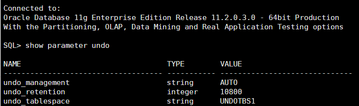
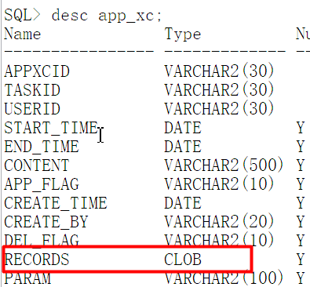
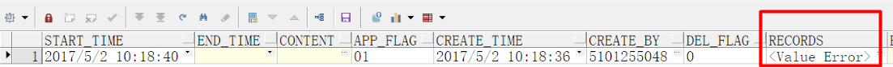

# ORA-01555和ORA-22924快照过旧问题

ORA-01555和ORA-22924同时出现，解决方法可以从如下三方面入手：

**Ⅰ.UNDO表空间过小，增加UNDO表空间**

```sql
# undo表空间的使用率
SELECT /* + RULE */ df.tablespace_name "Tablespace",df.bytes / (1024 * 1024) "Size (MB)",SUM(fs.bytes) / (1024 * 1024) "Free (MB)",Nvl(Round(SUM(fs.bytes) * 100 / df.bytes),1) "% Free",Round((df.bytes - SUM(fs.bytes)) * 100 / df.bytes) "% Used" FROM dba_free_space fs,(SELECT tablespace_name,SUM(bytes) bytes FROM dba_data_files
GROUP BY tablespace_name) df WHERE fs.tablespace_name (+) = df.tablespace_name GROUP BY df.tablespace_name,df.bytes UNION ALL SELECT /* + RULE */ df.tablespace_name tspace, fs.bytes / (1024 * 1024), SUM(df.bytes_free) / (1024 * 1024), Nvl(Round((SUM(fs.bytes) - df.bytes_used) * 100 / fs.bytes), 1), Round((SUM(fs.bytes) - df.bytes_free) * 100 / fs.bytes) FROM dba_temp_files fs, (SELECT tablespace_name,bytes_free,bytes_used FROM v$temp_space_header GROUP BY tablespace_name,bytes_free,bytes_used) df WHERE fs.tablespace_name (+) = df.tablespace_name GROUP BY df.tablespace_name,fs.bytes,df.bytes_free,df.bytes_used ORDER BY 4 DESC;

# undo表空间大小设置（估算方法）
SELECT (UR * (UPS * DBS)) AS "Bytes" FROM (select max(tuned_undoretention) AS UR from v$undostat), (SELECT undoblks / ((end_time - begin_time) * 86400) AS UPS FROM v$undostat WHERE undoblks = (SELECT MAX (undoblks) FROM v$undostat)),  (SELECT block_size AS DBS FROM dba_tablespaces WHERE tablespace_name = (SELECT UPPER(value) FROM v$parameter WHERE name = 'undo_tablespace'));
```

> undo表空间使用率：http://blog.itpub.net/29821678/viewspace-1323215/

**Ⅱ.undo_retention时间太短（默认为15分钟）**

```sql
show parameter undo;
ALTER SYSTEM SET undo_retention=10800 SCOPE=BOTH; 
```



调整undo_retention可能会遇到新的问题，如：ORA-32001: write to SPFILE requested but no SPFILE is in use

> 解决办法：https://blog.csdn.net/songyundong1993/article/details/53307931

**Ⅲ.可能与*LOB字段有关，其中部分异常数据触发oracle bug**



① 建一张临时表存储所有corrupted LOBs行的rowid

```sql
create table corrupt_lobs (corrupt_rowid rowid, err_num number);
```

② 运行如下PLSQL block

```sql
declare
error_1578 exception;
error_1555 exception;
error_22922 exception;
pragma exception_init(error_1578,-1578);
pragma exception_init(error_1555,-1555);
pragma exception_init(error_22922,-22922);
n number;
begin
for cursor_lob in (select rowid r,  records zp from tgdld.app_xc) loop
begin
n:=dbms_lob.instr(cursor_lob.zp,hextoraw('889911'));
exception
when error_1578 then
insert into corrupt_lobs values (cursor_lob.r, 1578);
commit;
when error_1555 then
insert into corrupt_lobs values (cursor_lob.r, 1555);
commit;
when error_22922 then
insert into corrupt_lobs values (cursor_lob.r, 22922);
commit;
end;
end loop;
end;
```

***PS.注意表名不要弄错！！！***

③ 查询异常数据

```sql
select t.*,t.rowid from app_xc t where t.rowid in (select corrupt_rowid from corrupt_lobs)
```



④ 用如下语句把相应行的clob字段清空

```sql
update app_xc set records = empty_clob() where rowid in (select corrupt_rowid from corrupt_lobs)
```

操作完以上4个步骤后，由*LOB带来的问题得到解决。